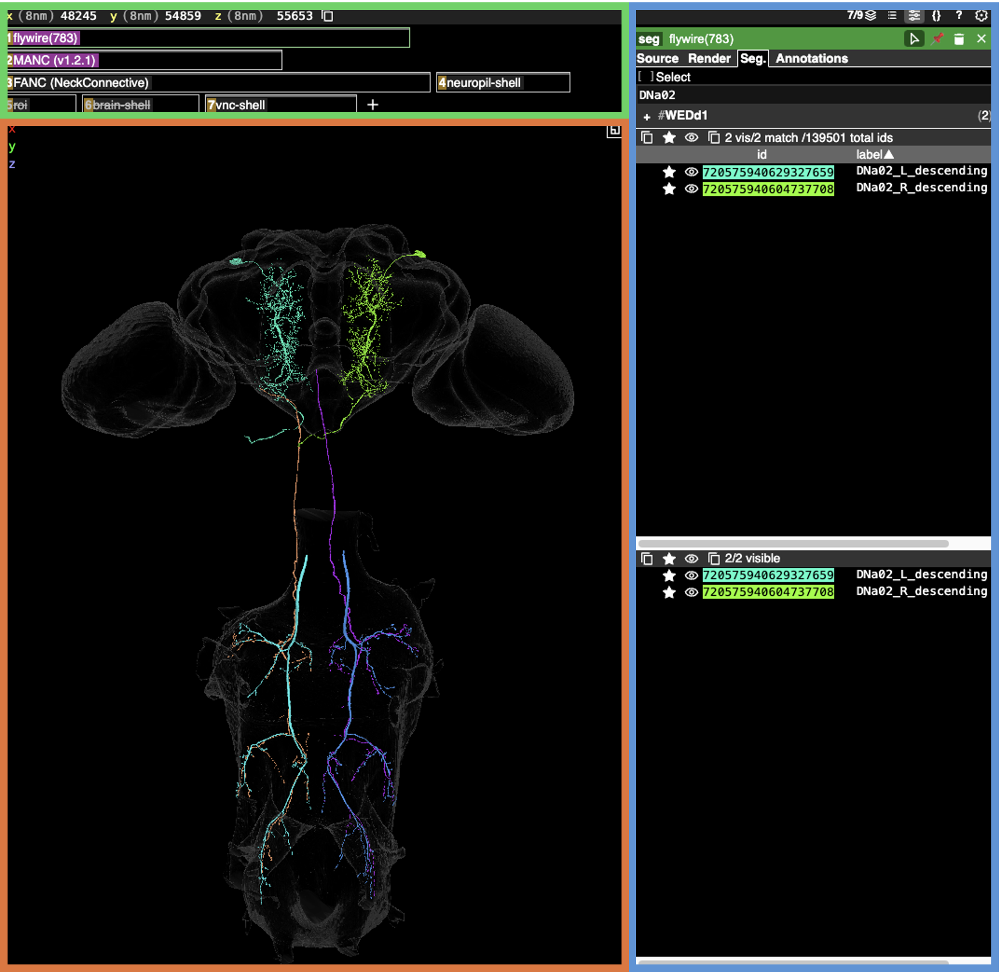
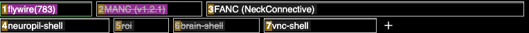
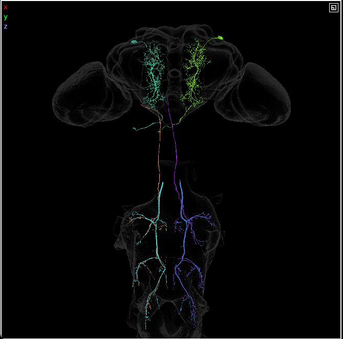
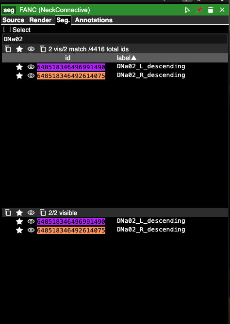
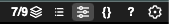

# [cocoglancer ](https://tinyurl.com/NeckConnective)

[neuroglancer](https://github.com/google/neuroglancer) is a web viewer for volumetric EM data (Maitin-Shepard et al. 2021). We have created a Neck Connective ‘scene’ within neuroglancer (**cocoglancer**) to co-visualize neurons from the three datasets from our manuscript simultaneously: FAFB, FANC and MANC. It includes all neck connective neurons, as well as the intrinsic motor and pre-motor neurons described in the manuscript.

cocoglancer allows male and female VNC neurons to be overlaid and morphologically compared. It also enables the simultaneous selection of brain (FAFB) and VNC (FANC, MANC) neurons  effectively simulating their complete CNS morphology. However, this is restricted to neurons that are matched to confocal images of the entire CNS (i.e., DNs without the additional "e", such as DNa02, etc.).

## Navigating cocoglancer

The cocoglancer web viewer, available at https://tinyurl.com/NeckConnective is split into 3 windows (A, B, C).

A. Data Layers (green)

B. 3D Visualisation (orange)

C. Annotation (blue)

### Data Layers (Window A)

This window contains 7 data layers corresponding to:

1. **flywire(783)** - Flywire segmentation version 783, with meshes in static maleCNS space.
2. **MANC(v1.2.1)** - Static MANC meshes v1.2.1 in MANC space (prepared by Sebastian Cachero).
3. **FANC (NeckConnective)** - FANC static meshes in MANC space (prepared by Sebastian Cachero).
4. **neuropil-shell** - FAFB central brain and optic lobe meshes (prepared by FlyEM, Janelia).
5. **roi** - FAFB neuropil meshes listed by abbreviation (see below for the list) prepared by FlyEM, Janelia.
6. **brain-shell** - Whole FAFB brain mesh prepared from Flywire synapse data by Philipp Schlegel and FlyEM, Janelia.
7. **vnc-shell** - Whole MANC surface mesh prepared by FlyEM, Janelia.

- Right-clicking on layers 1-3 brings up segment window C, where neurons can be searched and selected.
- Left-clicking on a layer toggles visibility.

### 3D Visualization (Window B)

The 3D visualization window allows simple rotation and zooming in on selected neurons. When many neurons are selected, you can double-click on one to hide it.

- To rotate: Left-click and drag the mouse.
- To zoom in: Press Ctrl + scroll the mouse wheel.
- Right-click centers the screen around the cursor.

### Annotation (Window C)

The annotation window shows all the neurons within each data layer. IDs or neuron names can be typed or pasted in, or neurons can be manually selected from the list under the "id" column.

- To view a neuron, click the "eye" to toggle between hidden and in view.
- Under "label," information about each neuron is displayed, such as type, side, and class (e.g., DNa02_L_descending).
- You can use regex in the search window to manually select multiple types of neurons. For example, to select DNp103 and DNp104: `/DNp10(3|4)`.

### Extra Features

In the top-right corner of the cocoglancer window, there are icons for further control. For this simplified version of neuroglancer, only the **?** icon will be useful. Clicking it displays a popup with shortcuts to various other functions.

### links to specific neurons from the manuscript
[DNs by sensory clusters](https://neuroglancer-demo.appspot.com/#!gs://flyem-user-links/short/DNSensoryClusters.json) - Figure 3 sensory ranking of descending neurons.

**Note**: Ask others about adding links to specific neurons from the manuscript, e.g., all sex-specific/dimorphic neurons or some specific subsets.

## Acknowledgements

Neuroglancer was developed by the Connectomics at Google team by  [Jeremy Maitin-Shepard](https://github.com/jbms) from Google Brain team.
